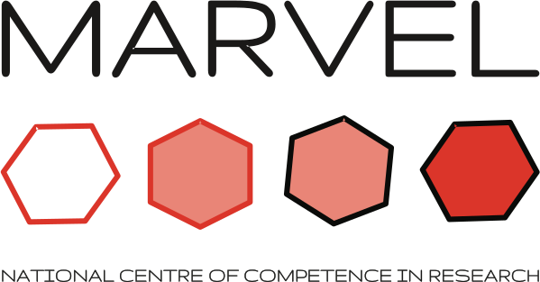

---
myst:
  substitutions:
    README.md of the repository: '`README.md` of the repository'
    aiida-core documentation: '`aiida-core` documentation'
    aiida-hubbard: '`aiida-hubbard`'
    mapex: '[MAPEX](https://www.uni-bremen.de/en/mapex)'
    ubremen_exc: '[U Bremen Excellence Chair](https://www.uni-bremen.de/u-bremen-excellence-chairs)'
    esg: "[Excellence Strategy of Germany\u2019s federal and state governments](https://www.dfg.de/en/research_funding/excellence_strategy/index.html)"
---

```{toctree}
:hidden: true
:maxdepth: 2

installation/index
tutorials/index
howto/index
topics/index
reference/index
```

::::{grid}
:reverse:
:gutter: 2 3 3 3
:margin: 1 2 1 2

:::{grid-item}
:columns: 12 4 4 4

```{image} images/logo_aiida_quantumespresso.png
:width: 200px
:class: sd-m-auto
```
:::

:::{grid-item}
:columns: 12 8 8 8
:child-align: justify
:class: sd-fs-5

# AiiDA Quantum ESPRESSO HP

An AiiDA plugin package for the calculation of Hubbard parameters using the [Quantum ESPRESSO](http://www.quantumespresso.org) software suite. Compute onsites and intersites Hubbard parameters self-consistently and in automated fashion through state-of-the-art DFPT implementation with automatic data provenance provided by AiiDA.

**aiida-hubbard version:** {{ release }}

:::

::::

______________________________________________________________________


::::{grid} 1 2 2 2
:gutter: 3

:::{grid-item-card} {fa}`rocket;mr-1` Get started
:text-align: center
:shadow: md

Instructions to install, configure and setup the plugin package.

+++

```{button-ref} installation/index
:ref-type: doc
:click-parent:
:expand:
:color: primary
:outline:

To the installation guides
```
:::

:::{grid-item-card} {fa}`info-circle;mr-1` Tutorials
:text-align: center
:shadow: md

Easy examples to take the first steps with the plugin package.

+++

```{button-ref} tutorials/index
:ref-type: doc
:click-parent:
:expand:
:color: primary
:outline:

To the tutorials
```
:::

:::{grid-item-card} {fa}`question-circle;mr-1` How-to guides
:text-align: center
:shadow: md

Hands-on guides to achieve specific goals.

+++

```{button-ref} howto/index
:ref-type: doc
:click-parent:
:expand:
:color: primary
:outline:

To the how-to guides
```
:::

:::{grid-item-card} {fa}`bookmark;mr-1` Topic guides
:text-align: center
:shadow: md

Detailed background information on various concepts.

+++

```{button-ref} topics/index
:ref-type: doc
:click-parent:
:expand:
:color: primary
:outline:

To the topic guides
```
:::

:::{grid-item-card} {fa}`cogs;mr-1` Reference guides
:text-align: center
:shadow: md

Detailed reference guides on the application programming and command line interfaces.

+++

```{button-ref} reference/api/aiida_hubbard/index
:ref-type: doc
:click-parent:
:expand:
:color: primary
:outline:

To the reference guides
```
:::
::::

# How to cite

If you use this plugin for your research, please cite the following work:

> Lorenzo Bastonero, Cristiano Malica, Marnik Bercx, Eric Macke, Iurii Timrov, Nicola Marzari, and Sebastiaan P. Huber, [*Automated self-consistent prediction of extended Hubbard parameters for Li-ion batteries*](https://media.giphy.com/media/zyclIRxMwlY40/giphy.gif), npj Comp. Mat., **?**, ? (2023)

> Sebastiaan. P. Huber, Spyros Zoupanos, Martin Uhrin, Leopold Talirz, Leonid Kahle, Rico Häuselmann, Dominik Gresch, Tiziano Müller, Aliaksandr V. Yakutovich, Casper W. Andersen, Francisco F. Ramirez, Carl S. Adorf, Fernando Gargiulo, Snehal Kumbhar, Elsa Passaro, Conrad Johnston, Andrius Merkys, Andrea Cepellotti, Nicolas Mounet, Nicola Marzari, Boris Kozinsky, and Giovanni Pizzi, [*AiiDA 1.0, a scalable computational infrastructure for automated reproducible workflows and data provenance*](https://doi.org/10.1038/s41597-020-00638-4), Scientific Data **7**, 300 (2020)

> Martin Uhrin, Sebastiaan. P. Huber, Jusong Yu, Nicola Marzari, and Giovanni Pizzi, [*Workflows in AiiDA: Engineering a high-throughput, event-based engine for robust and modular computational workflows*](https://www.sciencedirect.com/science/article/pii/S0010465522001746), Computational Materials Science **187**, 110086 (2021)

> Iurii Timrov, Nicola Marzari, and Matteo Cococcioni, [*HP - A code for the calculation of Hubbard parameters using density-functional perturbation theory*](https://doi.org/10.1016/j.commatsci.2020.110086), Computational Materials Science **187**, 110086 (2021)

> Iurii Timrov, Nicola Marzari, and Matteo Cococcioni, [*Self-consistent Hubbard parameters from density-functional perturbation theory in the ultrasoft and projector-augmented wave formulations*](https://journals.aps.org/prb/abstract/10.1103/PhysRevB.103.045141), Physical Reveview **B** **103**, 045141

# Acknowledgements

We acknowledge support from:

:::{list-table}
:widths: 60 40
:class: logo-table
:header-rows: 0

* - The {{ ubremen_exc }} program funded within the scope of the {{ esg }}.
  - 
* - The {{ mapex }} Center for Materials and Processes.
  - 
* - The [NCCR MARVEL](http://nccr-marvel.ch/) funded by the Swiss National Science Foundation.
  - 
* - The EU Centre of Excellence ["MaX – Materials Design at the Exascale"](http://www.max-centre.eu/) (Horizon 2020 EINFRA-5, Grant No. 676598).
  - 
* - The [swissuniversities P-5 project "Materials Cloud"](https://www.materialscloud.org/swissuniversities)
  - 

:::

[aiida]: http://aiida.net
[aiida quantum espresso tutorial]: https://aiida-tutorials.readthedocs.io/en/tutorial-qe-short/
[aiida-core documentation]: https://aiida.readthedocs.io/projects/aiida-core/en/latest/intro/get_started.html
[aiida-hubbard]: https://github.com/aiidateam/aiida-hubbard
[aiidalab demo cluster]: https://aiidalab-demo.materialscloud.org/
[quantum espresso]: http://www.quantumespresso.org
[quantum mobile]: https://quantum-mobile.readthedocs.io/en/latest/index.html
